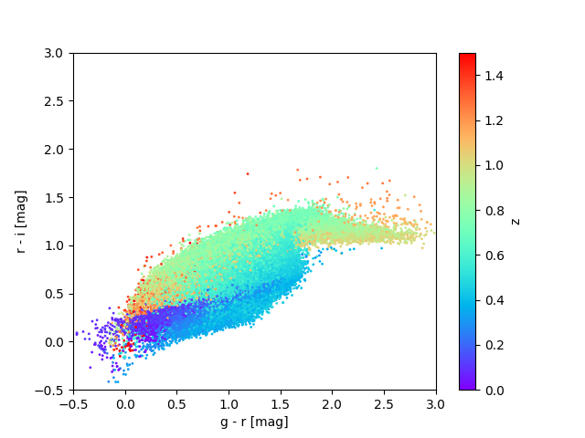
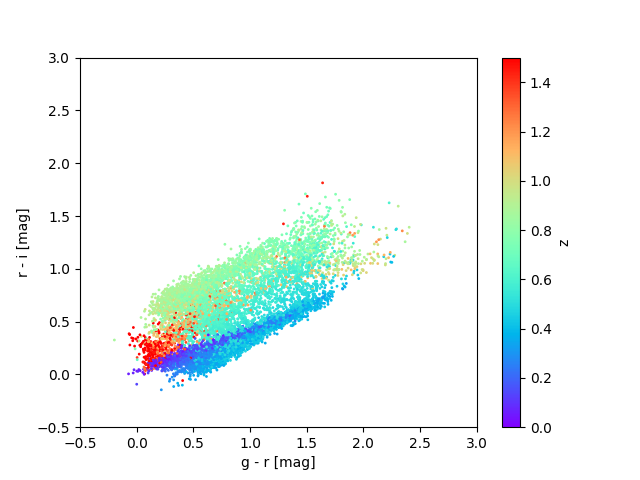
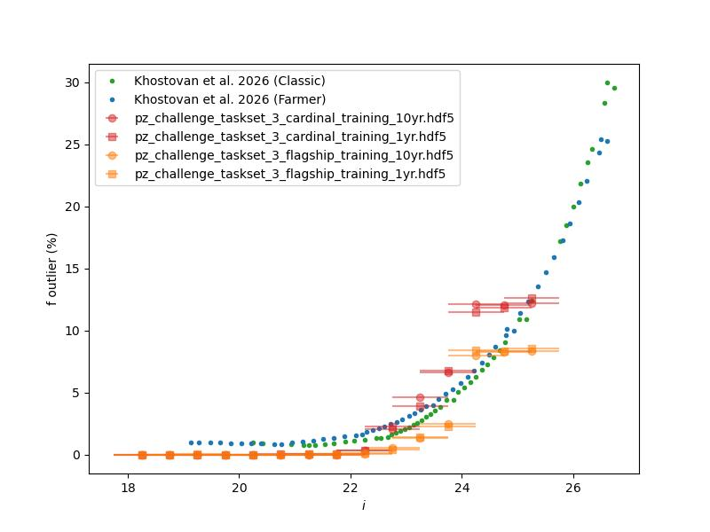
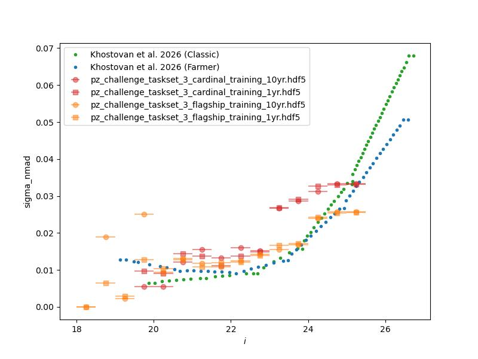
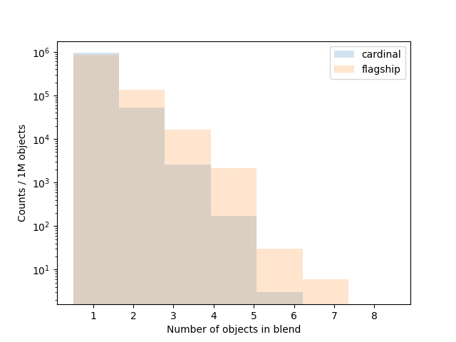
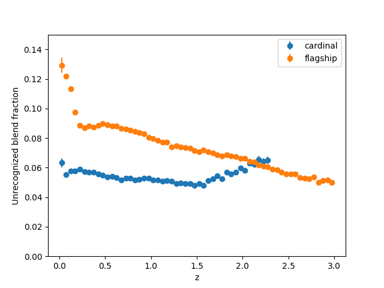
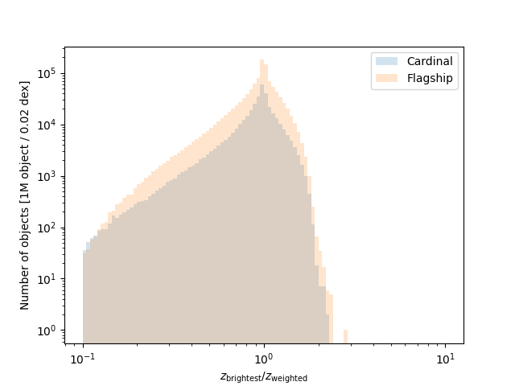
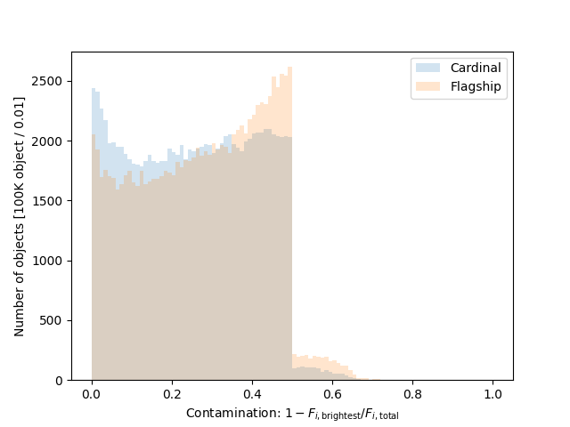

****************************************************************
Welcome to the Photometric Redshift Ensemble (NZ) Data Challenge
****************************************************************

The Dark Energy Science Collaboration (DESC) invites researchers, data
scientists, and astronomers to participate in the Photometric Redshift
Ensemble (NZ) Data Challenge, a collaborative effort to advance methods for
estimating the distribution of redshifts for ensembles of distant galaxies.
Photometric redshifts, derived from multi-band brightness measurements, are essential for
cosmological surveys like the Legacy Survey of Space and
Time (LSST), enabling us to map the universe's structure and probe the
nature of dark energy. This challenge provides a unique opportunity to
test and benchmark algorithms on realistic simulated data, compare
approaches across diverse methodologies—from template fitting to
machine learning—and help shape the tools that will unlock discoveries
from next-generation sky surveys.

The challenge is framed as a series of sets of PZ estimations tasks
using increasingly realistic data.

`Set up the pz_data_challenge package and download challenge data <installation_and_setup_>`_

`Information about the input data <challenge_input_data_>`_

`How to submit an entry to the challenge <challenge_submissions_>`_

`Description of challenge tasks <tasks_>`_

`Assessment Metrics <metrics_>`_

`Details about challenge data preparation <challenge_data_prep_>`_

`Write of up NZ Data Challenge documentation <https://portal.nersc.gov/cfs/lsst/PZ/data_challenge/nz_challenge.pdf>`_

======================
Background Information
======================

.. _intro:

Introduction
============

Redshift inference is a key element of many DESC science goals, and
redshift uncertainty is one of the leading contributors to the overall
uncertainty on cosmological models from imaging survey data. Precursor
surveys took a variety of approaches to this problem, accounting for
differences in underlying data as well as modeling approaches. In all
cases, redshift uncertainty was significantly larger than the
requirements listed in the LSST DESC Science Requirements Document.

This state of the art motivates a data challenge to characterize and
improve existing methods, as well as to provide infrastructure for the
development of improved methods. Overall, this requires generating
uniform input catalogs and infrastructure for comparing output redshift
posteriors for ensembles to each other and to simulated truth catalogs.

Estimating ensemble-level :math:`n(z)` distributions differs from
measuring per-object :math:`p(z)` distributions in many ways. Depending
on the method, estimating :math:`n(z)` distributions may or may not
include :math:`p(z)` estimation along the way.

.. _redshift_basics:

Photometric redshift basics
===========================

Photometric redshift estimation involves taking a catalog of galaxies
for which we have observations in several different filters and have
measured the brightness of the galaxies in those bands, and using that
information to estimate the redshift of the galaxies. For LSST we expect
to have measurements in 6 bands: ’u’, ’g’, ’r’, ’i’, ’z’, and ’y’,
covering a wavelength range from approximately 320 to 1600 nanometers.
For the Roman space telescope, this will extend from about 500 to 2300
nanometers.

Much of the information used to estimate photometric redshifts derives
from the ’Balmer break’ present in the rest frame of many spectra at 400
nm. As the break crosses into different optical filters with increasing
redshift, the differences in magnitudes between filters carry
information about the redshift;

.. container:: figure*

   .. image:: figures/static_balmer.png
      :alt: image
      :width: 80.0%

.. container:: figure*

   |image| |image1|

This overly simple picture is complicated somewhat by the fact that
different galaxies have different intrinsic spectra and colors:

.. container:: figure*

   .. image:: figures/gr_vs_sz_sidebyside.jpg
      :alt: image
      :width: 80.0%

This is further complicated by the fact that reference redshifts,
typically obtained by spectroscopy, slitless spectroscopy (i.e., GRISM
measurements), or narrowband photometric measurements, are not a
representative sample, as they are much easier to obtain for brighter
objects. Depending on the method used to obtain the reference redshifts,
they are also susceptible to errors such as confusing different spectral
lines or confusion of blended objects. Some of the tasks in this data
challenge encourage participants to try to address these complications.

.. _challenge_format:

Challenge Format
================

The NZ data challenge comprises a series of sets of tasks for
participants. Submissions will be evaluated to determine how ready
various algorithms are to be used for cutting-edge analysis based on how
well they perform on the various tasks. Readiness will be evaluated on a
few different fronts: 1) Does the algorithm meet performance
requirements? 2) Is it robust, flexible, and relatively easy to use on
different datasets? 3) Is it scalable to the scales we will need?

This document and the associated web pages describe the data being
provided to participants, the tasks they will be asked to perform, the
expected format for submissions, and the metrics by which algorithm
readiness will be evaluated.

Scope and Timeline
------------------

The data challenge includes two major parts, with a set of tasks
emulating increasingly realistic scenarios in each part. The percursor,
“PZ data challenge”, assessing per-object :math:`p(z)` estimation, was
launched in April 2026 and will conclude in September 2026. The part
desribed here, the “NZ data challenge”, covering tomography and
:math:`n(z)` estimation, will focus on assigning objects to tomographic
bins and estimating the distribution of redshifts in each bin, and will
launch in September 2026 and conclude in January 2027.

Preliminary results for the NZ part of the challenge with a technical
note summarizing those results to follow shortly thereafter and a
comprehensive journal publication to follow later.

Installing and setting up the ``nz_data_challenge`` package
-----------------------------------------------------------

.. _installation_and_setup:

The ``nz_data_challenge`` package will provide participants with tools
to access data, set up submissions, estimate performance metrics and
format submissions. This can be set up with a few small variants on the
standard ``GitHub`` package setup procedure. Before starting you should
pick a name for your submission, e.g., “example”.

::

   # Create a conda environment
   conda create --name nzdc python=3.13

   # Clone the nz_data_challenge repository (or your fork of the repository)
   git clone git@github.com:LSSTDESC/nz_data_challenge.git
   # or git clone https://github.com/LSSTDESC/nz_data_challenge.git

   # Go into the directory
   cd nz_data_challenge

   # Install the code in "editable" mode
   pip install -e ".[dev]"

   # Use the provided script to set up your submission.
   # Here you should provide the name of your submission
   python scripts/prepare_submission.py <submission_name>

This final step will copy the input data files to
``nz_data_challenge/public``, and set up the three files you will need
to submit your entry.

The notebooks in the ``nz_data_challenge/nb`` area give examples of how
to access the data and create some of the diagnostic plots that were
used to validate the data.

Submission mechanism
--------------------

Submission will take the form of pull request in the
``nz_data_challenge`` repository. Detailed instructions on how to submit
an entry are provided in `challenge_submissions`_ of this
document.

.. _challenge_input_data:

Challenge Input Data
====================

The preparation of the challenge data is described in the appendices.
The data are available as a ``tar`` archive that is downloaded and
unpacked as part of the ``nz_data_challenge`` setup procedure.

Each task set in the data challenge has an associated set of files.
Typically these will be a collection of training files that contain
photometric data and reference redshifts, and a second set of files that
contain photometric data but do not include redshifts. Each task set
will involve estimating something about the redshifts or redshift
distributions in the test files.

Typically there will be several training and test files for a particular
task set, covering different scenarios and using different input
simulations.

Input data format
-----------------

The input data for the challenge are presented in HDF5 files. The naming
convention for the files is
``{challenge}_{taskset}_{simulation}_{label}_{scenario}.hdf5``. The
meanings of the various fields are described in the next table.
The columns in the files are described in table after.
We note that we use ``np.nan`` to in the
magnitude columns to signify non-detections.

.. container::
   :name: tab:file_fields

   .. table:: Fields in the input file names.

      ========== ==========================================================
      Field      Description
      ========== ==========================================================
      challenge  Challenge associated with file (“nz_challenge”)
      taskset    Task set associated with file (e.g., “taskset_1”)
      simulation Simulation used to produce file (“cardinal” or “flagship”)
      label      File label (e.g., “ddf_03”, “wfd)
      scenario   Data scenario (e.g., “1yr”, “4yr”’)
      ========== ==========================================================

.. container::
   :name: tab:file_types

   .. table:: File Types. The “ddf_00” fields have reference redshifts from all spectroscopic samples. The other “ddf” fields emulate the incomplete coverage coming only from the “DESI” samples.

      ====== ===========================================================
      Label  Description
      ====== ===========================================================
      wfd    “Wide, Fast, Deep”, emulating LSST and Roman survey data
      ddf_00 “Deep-drilling field 0”, emulating COSMOS deep field.
      ddf_0X “Deep-drilling field 1,2,3,4”, emulating other deep fields.
      ====== ===========================================================

      
.. container::
   :name: tab:columns

   .. table:: Contents of input files.

      ==================== =====================================
      Column               Description
      ==================== =====================================
      redshift             True redshift (training files only)
      ra                   Right ascension (training files only)
      dec                  Declination (training files only)
      object_id            Unique object ID
      mag_{band}_lsst      Magnitude in LSST {band}
      mag_{band}_lsst_err  Magnitude uncertainty in LSST {band}
      mag_{band}_roman     Magnitude in Roman {band}
      mag_{band}_roman_err Magnitude uncertainty in Roman {band}
      ==================== =====================================

We note that the ``table-io`` package  :raw-latex:`\cite{tables_io}`
installed with ``nz_data_challenge`` provided a command line interface
to convert files from ``hdf5`` format to other formats such as
``parquet`` tables or ``pandas`` data frames.

::

   # convert a hdf5 file to pandas dataframe in a parquet file
   tables-io convert
     --input public/nz_challenge_taskset_1_flagship_4yr_ddf_03.hdf5
     --output public/nz_challenge_taskset_1_flagship_4yr_ddf_03.pq

.. _challenge_submissions:

Challenge Submissions
=====================

Challenge subtask types
-----------------------

The challenge is organized as a series of sets of tasks using
increasingly realistic representations of the data. In general, each set
of tasks includes 3 subtasks.

#. Provide tomographic bin assignments for all objects and estimate
   ensemble :math:`n(z)` distributions for a set of different scenarios
   in a specified format.

#. Provide trained models for the different scenarios and a Python
   function that can be used to generate the estimates from subtask 1 on
   an arbitrary dataset. GitHub Actions will not run these functions as
   part of submission validation, but they may be run later as part of
   the challenge.

#. Provide a Python function that can be used to generate the models and
   estimates from subtasks 1 and 2 on arbitrary datasets. Again, GitHub
   Actions will not run these as part of submission validation, but they
   may be run later as part of the challenge.

The :math:`n(z)` estimates, bin assignments, and (for taskset 3)
:math:`n(z)` samples from subtask 1 should be provided in a compressed
``tar`` file. A ``timing.yaml`` file is not required and is not checked
by CI. Any models used in subtask 2 should be provided in a separate
``tar`` file. Templates and instructions for the Python functions needed
for subtasks 2 and 3 are described below.

Data format for submissions
---------------------------

Each submisison will require creating a set of files described below and
packaging them in a specific format.

Data format for bin assignments
~~~~~~~~~~~~~~~~~~~~~~~~~~~~~~~

The bin assignments should be provided as an HDF5 file containing a
dictionary with two arrays: object IDs (``object_id``) and corresponding
bin assignments (``tomo_bin_index``). The tomographic bins should
run from 0 to :math:`n_{\rm bins} -1`. The value :math:`-1` is reserved
as a guard value for unassigned objects. The files should be called
e.g. ``nz_challenge_taskset_1_cardinal_1yr_bhat_wfd.hdf5``.

Format tests do **not** read catalog IDs from the public WFD files.
``submit_utils.check_submission`` currently compares ``object_id`` to
sequential integers: taskset 1 starts at 0, tasksets 2 and 3 start at
4,000,000, then add 1,000,000 for each ``(simulation, scenario)``
combination in the order cardinal/flagship × 1yr/4yr. Write those IDs
(not the simulation ``object_id`` column) unless the validator is
updated.

::

   import numpy as np
   import tables_io

   n = 1_000_000
   start = 0  # taskset_1_cardinal_1yr; see check_submission offsets
   data_dict = dict(
       tomo_bin_index=bin_assignments,
       object_id=np.arange(start, start + n),
   )
   tables_io.write(data_dict, <output_filename.hdf5>)

Data format for ensemble :math:`n(z)` estimates
~~~~~~~~~~~~~~~~~~~~~~~~~~~~~~~~~~~~~~~~~~~~~~~

The :math:`n(z)` estimates should be submitted in ``qp`` format, which
allows users to specify a complete :math:`n(z)` distribution for each
tomographic bin, as well as summary statistics for each ensemble.

The ``qp`` package :raw-latex:`\cite{QP}` supports several different
representations of :math:`n(z)`, such as different functional forms as
well as interpolated grids, histograms, and others.

For users unfamiliar with ``qp``, we highly recommend representing the
:math:`n(z)` as either a histogram grid or a Gaussian mixture model. The
files should be called
e.g. ``nz_challenge_taskset_1_cardinal_1yr_nz_estimate_wfd.hdf5``.

::

   # Interpolated grid
   import qp
   import numpy as np
   # Define the histogram bins. Note that we put all the
   # n(z) on the same binning
   bins = np.array([0,0.5,1,1.5,2])
   # Define the y-values. Note we provide n_grid_points-1 x n_objects 
   # values, as we need to provide a y-value at histogram bin 
   # for each object.
   yvals = np.array(
    [
      [0.01,0.2,0.3,0.49],
      [0.1,0.3,0.5,0.1]
    ]
   )
   ensemble = qp.hist.create_ensemble(bins,yvals)
   ensemble.write_to(<output_filename.hdf5>)

::

   # Mixture model
   import qp
   import numpy as np
   # Define the means, standard deviations, and weights.
   # These should each have shape n_objects, n_components.
   # In this case we are defining 3 objects with 2-Gaussian 
   # representations.
   # For each object the weights should sum to 1, or they
   # will be normalized.
   means = [[0.3, 0.4], [0.5, 0.5], [0.6, 0.8]]
   stds = [[0.2, 0.4], [0.1, 0.3], [0.05, 0.3]]
   weights = [[0.8, 0.2], [0.7, 0.3], [0.8, 0.2]]
   ensemble = qp.mixmod.create_ensemble(means=means,stds=stds,weights=weights)
   ensemble.write_to(<output_filename.hdf5>)

Data format for ensemble :math:`n(z)` samples
~~~~~~~~~~~~~~~~~~~~~~~~~~~~~~~~~~~~~~~~~~~~~

The :math:`n(z)` samples should also be submitted in ``qp`` format.
Unlike the :math:`n(z)` estimate files, which provide a single PDF for
each tomographic bin, the :math:`n(z)` samples should provide a sample
of 100 “equally likely” PDFs for each tomographic bin. The bin index and
sample realization number associated with each PDF can be added to a
``qp`` ensemble using code like this:

::

   ensemble = qp.hist.create_ensemble(bins,yvals)
   n_samples = 100
   n_tomo_bins = 5
   i_realization = np.arange(n_samples)
   bin_idx = np.arange(n_tomo_bins)
   ensemble.set_ancil(
       dict(
           bin_idx=np.repeat(bin_idx, n_samples),
           i_realization=np.tile(i_realization, n_tomo_bins),
       )
   )

Packaging submission files
~~~~~~~~~~~~~~~~~~~~~~~~~~

Submission products unpacked by CI use names of the form
``nz_challenge_{taskset}_{simulation}_{scenario}_{label}_wfd.hdf5``,
where ``label`` is ``nz_estimate`` or ``bhat`` (tasksets 1 and 2) or
``nz_samples`` (taskset 3), e.g.,

::

   nz_challenge_taskset_1_cardinal_1yr_nz_estimate_wfd.hdf5
     or
   nz_challenge_taskset_1_cardinal_1yr_bhat_wfd.hdf5
     or
   nz_challenge_taskset_3_cardinal_1yr_nz_samples_wfd.hdf5

All of these files should then be joined into a compressed ``tar`` file
with no extra top-level directory, hosted at a URL that GitHub Actions
can fetch without authentication. Set that URL as ``SUBMISSION_URL`` in
``src/nz_data_challenge/{submission}.py`` (the tests import it). Models
for subtask 2 go in a second ``tar`` file whose URL is ``MODEL_URL`` in
the same module.

::

   SUBMISSION_NAME = "example"
   SUBMISSION_URL = "https://your.institution.edu/submit_example.tgz"
   MODEL_URL = "https://your.institution.edu/submit_example_models.tgz"

   
Format for estimation-only Python functions and trained models
--------------------------------------------------------------

For the second subtask, submissions should provide trained models and
implement a function to run estimation using those trained models on the
test files provided for each task set.

The function will look something like this:

::

   def run_taskset_1_estimation_only(
       key: str,
       wfd_file: str | Path,
       models_dir: str | Path,
       output_nz_estimate_file: str | Path,
       output_bhat_file: str | Path,
       output_nz_samples_file: str | Path | None,    
   ) -> None:    

or

::

   def run_taskset_2_estimation_only(
       key: str,
       wfd_file: str | Path,
       models_dir: str | Path,
       output_nz_estimate_file: str | Path,
       output_bhat_file: str | Path,
       output_nz_samples_file: str | Path | None,    
   ) -> None:

Templates for these functions are provided in the file
``src/nz_data_challenge/{submission_name.py}`` created as part of the
setup.

The ``models_dir`` area can be used to download existing models
from a URL that can be set in the same file.

::

   MODEL_URL = "https://your.institution.edu/submit_example_models.tgz"

Format for training and estimation Python functions
---------------------------------------------------

For the third subtask, submissions should implement a function to train
models and run estimation using those trained models on the training and
test files provided for each task set. The function will look something
like this:

::

   def run_taskset_1_training_and_estimation(
       key: str,
       wfd_file: str | Path,
       models_dir: str | Path,
       ddf_files: list[str | Path],
       output_nz_estimate_file: str | Path,
       output_bhat_file: str | Path,
       output_nz_samples_file: str | Path | None,     
   ) -> None:

or

::

   def run_taskset_2_training_and_estimation(
       key: str,
       wfd_file: str | Path,
       models_dir: str | Path,
       ddf_files: list[str | Path],
       output_nz_estimate_file: str | Path,
       output_bhat_file: str | Path,
       output_nz_samples_file: str | Path | None,     
   ) -> None:

Templates for these functions are provided in the file
``src/nz_data_challenge/{submission_name}.py`` created as part of the
setup.

In this case, the ``models_dir`` area is primarily intended as a working
area to create the models needed by the algorithm.

.. _submission-process:

Submission process
------------------

Submissions will take the form of a pull request on the
``nz_data_challenge`` repository and will include:

#. A file ``src/nz_data_challenge/{submission}.py`` that includes
   ``SUBMISSION_URL`` / ``MODEL_URL`` and the Python functions for
   subtasks 2 and 3. When created this will contain empty placeholder
   functions that will need to be implemented.

#. A file ``tests/test_{submission}.py`` that includes the test
   functions that import those URLs and run the user-provided code.

#. A file ``requirements_{submission}.txt`` that should be modified to
   include ``pip`` package names of any packages that need to be
   installed in order to run the functions in subtasks 2 and 3.

#. A file ``.github/workflows/submit_{submission}.yaml`` to run the
   submission validation in a GitHub action. This should not need to be
   modified unless the prerequisite installation requires more than just
   ``pip``-installing packages.

All four of these files are created by the
``scripts/prepare_submission.py`` script.

You will need to modify ``src/nz_data_challenge/{submission}.py`` to
give the locations of the estimate and model ``tar`` files and to
implement the required functions.

See ``https://github.com/LSSTDESC/nz_data_challenge/pull/7`` for an
example of a submission.

Submission validation
---------------------

The wrapping functions provided in the ``tests/test_{submission}.py``
file implement a number of checks on the data. Specifically, for each
expected file they check that:

#. the :math:`n(z)` file exists (name
   ``nz_challenge_{taskset}_{sim}_{scenario}_nz_estimate_wfd.hdf5``);

#. the :math:`n(z)` file contains a valid ``qp`` ensemble with the
   expected number of :math:`n(z)` pdfs;

#. the ``qp`` ensemble includes ancillary data;

#. the ancillary data includes a “n_objects” column with numbers of
   objects assigned to each bin;

#. the :math:`bhat` file exists (name
   ``nz_challenge_{taskset}_{sim}_{scenario}_bhat_wfd.hdf5``);

#. the :math:`bhat` file contains ``tomo_bin_index`` and ``object_id``
   for each object;

#. the ``object_id`` values match the sequential IDs constructed by
   ``submit_utils.check_submission`` (not the catalog IDs in the public
   WFD files).

For taskset 3, similar checks are performed on the
``..._nz_samples_wfd.hdf5`` ensemble :math:`n(z)` samples.

GitHub Actions only run ``pytest -k submit_{taskset}`` (format checks on
the hosted estimates tar). They do not retrain models and do not require
``timing.yaml``.

If any of these checks fail, the GitHub action triggered by the
submission will fail and report the cause of the failure. **Note that
the GitHub actions occasionally fail to download the data files. If this
happens, simply re-running the action typically succeeds.**

The easiest way to test that your hosted tar matches CI is:

::

   # Make sure that you have installed any packages you need
   pip install -r requirements_{submission_name}.txt

   # Format checks only (same as GitHub Actions)
   python -m pytest -k submit_ tests/test_{submission_name}.py

If this succeeds, you can use a provided script to help you open the
pull request for your submission.

::

   # run the submission helper script.
   python scripts/submit.py {submission_name}

Note that the helper script only prints the required commands; it does
not run them. In short, the commands are:

::

   # Check status of your local git clone by running git status, and make
   # sure that you are on the branch submit/{submission_name} and do not
   # have any files added or modified
   git status

   # Add your files to git
   git add .github/workflows/submit_example.yaml
     src/nz_data_challenge/example.py
     requirements_example.txt
     tests/test_example.py

   # Commit your files to your branch: 
   git commit -m "Submitting {submission_name}"
     .github/workflows/submit_{submission_name}.yaml
     src/nz_data_challenge/{submission_name}.py
     requirements_{submission_name}.txt
     tests/test_{submission_name}.py

   # Push your commit
   git push --set-upstream origin submit/{submission_name}

   # Pushing to git should give you a URL that you can visit to create a
   # pull request, for example:
   #   https://github.com/LSSTDESC/nz_data_challenge/pull/new/submit/example
   # If you do not have write access to LSSTDESC/nz_data_challenge, push
   # to a fork and open the pull request from there.
   # Visit that URL and create a pull request, then add the 'submission'
   # label to the PR.
   # Finally, make sure that the github action validating your submission
   # succeeds and fix any issues.

   
Submission aids
---------------

A few scripts are provided to help you.

-  ``scripts/download_public.py``: downloads and unpacks the public
   data.

-  ``scripts/prepare_submission.py``: sets up your area for a
   submission, creates the needed files from templates, downloads the
   public data, and suggests that you create a branch for your
   submission.

-  ``scripts/remove_submission_files.py``: removes the submission files
   if you need to start over.

-  ``scripts/run_metrics.py``: runs performance metrics on files in a
   submission you have created.

-  ``python -m pytest -k submit_ tests/test_{submission_name}.py``:
   format-checks the hosted estimates tar (same tests as GitHub Actions).

.. _metrics:

Metrics and Assessment Criteria
===============================

We will use a number of different metrics to assess the performance of
the submitted algorithms. Many of these metrics, as well as the
motivations behind them, are defined and discussed in
Ref. :raw-latex:`\cite{therailteam2025}`.

Metrics for bin assignment
--------------------------

Performance on bin-assignement estimates, i.e., how well the algorithm
assigns objects to the desired tomographic bin are based on the
confusion matrix. I.e., the matrix :math:`N_{\rm true, \rm assigned}`.
In the ideal case this matrix would be diagonal, i.e., all the objects
would be assigned to the true bin.

We then use this to construct the following metrics:

Performance on bin-assignment estimates, i.e., how well the algorithm
assigns objects to the desired tomographic bin, is assessed using the
confusion matrix :math:`N_{\rm true, assigned}`. In the ideal case this
matrix would be diagonal, i.e., all the objects would be assigned to the
true bin.

We use the following metrics to quantify performance:

-  **Accuracy**: The fraction of objects that are correctly assigned to
   their true tomographic bin, i.e.,
   :math:`{\rm Accuracy} = N_{\rm correct} / N_{\rm total}`.

-  **Balanced Accuracy**: The mean of the per-class recall values. For
   each tomographic bin :math:`k`, we compute the recall
   :math:`R_k = {\rm TP}_k / N_k`, where :math:`{\rm TP}_k` is the
   number of true positives and :math:`N_k` is the number of objects
   truly in bin :math:`k`. The balanced accuracy is then
   :math:`{\rm BA} = \frac{1}{K}\sum_{k=1}^{K} R_k`. This metric
   accounts for unequal bin populations.

-  **Cohen’s Kappa**: Measures inter-rater agreement for categorical
   assignments, correcting for agreement occurring by chance. It is
   defined as :math:`\kappa = (p_o - p_e) / (1 - p_e)`, where
   :math:`p_o` is the observed agreement (fraction correctly assigned)
   and :math:`p_e` is the expected agreement by chance given the
   marginal distributions. Values range from :math:`-1` to :math:`1`,
   with :math:`1` indicating perfect agreement.

-  **Mutual Information**: The mutual information between the true
   redshift values and the bin assignments, estimated using
   scikit-learn’s mutual information estimator for continuous features
   and reported in bits. Higher values indicate that the bin assignments
   carry more information about the true redshift.

-  **Log Loss from Labels**: Constructs a one-hot probability matrix
   from the predicted bin labels (with a small smoothing
   :math:`\epsilon`) and evaluates the negative log-likelihood of the
   true labels:
   :math:`\mathcal{L} = -\frac{1}{N}\sum_{i=1}^{N} \log p(\hat{y}_i = y_i)`.
   Lower values indicate better assignments.

  
Metrics for ensemble :math:`n(z)` distributions
-----------------------------------------------

We also assess the algorithm’s ability to provide a precise and accurate
estimate of the :math:`n(z)` distribution for each tomographic bin using
the following metrics.

-  **Total Information Loss**: The weighted average of per-bin
   Kullback–Leibler divergences :math:`D_{\rm KL}(p_{\rm true} \| p_{\rm est})`,
   reported in bits. The weight for each bin is
   proportional to the number of objects assigned to that bin. This
   metric quantifies how much information is lost when the estimated
   distribution is used in place of the true one.

-  **Delta of mean shifts added in quadrature**: For each
   tomographic bin we compute the mean :math:`\mu_i` of both the
   estimated and true :math:`n(z)` distributions on the redshift grid,
   then report the root-mean-square of the per-bin differences:
   :math:`{\rm RMS}_\mu = \sqrt{\frac{1}{K}\sum_{i=1}^{K}(\mu_{i,{\rm est}} - \mu_{i,{\rm true}})^2}`.

-  **Delta of mean rms added in quadrature** (width shift):
   Analogous to the mean shift metric, but for the standard deviation
   :math:`\sigma_i` of each bin’s :math:`n(z)` distribution:
   :math:`{\rm RMS}_\sigma = \sqrt{\frac{1}{K}\sum_{i=1}^{K}(\sigma_{i,{\rm est}} - \sigma_{i,{\rm true}})^2}`.

Metrics for cosmology analysis (Fisher forecasts)
-------------------------------------------------

We also estimate how well each algorithm would perform in the context of
cosmological analyses by running Fisher matrix forecasts using the
``fisherA2Z`` package. For each submission we compute the
:math:`w_0`–:math:`w_a` dark energy Figure of Merit (FoM), defined as
the inverse area of the :math:`1\sigma` contour in the
:math:`w_0`–:math:`w_a` plane, under two analysis configurations:

-  **Cosmic Shear FoM**: A Fisher forecast using only the cosmic shear
   two-point correlation function.

-  **3\ :math:`\times`\ 2pt FoM**: A Fisher forecast using the full
   combination of cosmic shear, galaxy–galaxy lensing, and galaxy
   clustering (the “3\ :math:`\times`\ 2pt” data vector).

These forecasts use the submitted :math:`n(z)` estimates and the true
:math:`n(z)` distributions to quantify the bias in cosmological
parameters induced by errors in the redshift distributions. The forecast
accounts for survey-specific parameters including the effective source
number density per tomographic bin, fractional sky coverage, and
per-component ellipticity dispersion.

	 

Metrics for computational usability and performance
---------------------------------------------------

We will assess relevant aspects of the computational performance that
will affect usability and scaling.

-  **Ease of use**: We will assess whether the algorithm is easy to
   install and can be run on the different task sets without needing
   excessively complicated additional configuration files.

-  **Training time**: How quickly the algorithm trains models, and how
   this scales with the training sample size. Here we mainly want to
   ensure that the training time will not dominate the iteration cycle.
   Taking a couple of hours to train on 1M objects is fine; taking days
   to do so would be problematic.

-  **Model size**: How large the trained model files are, and how this
   scales with the training sample size. Again, we mainly want to ensure
   that the model size will not tax our resources. If the model files
   are an order of magnitude larger than the input data files, we might
   worry.

-  **Estimation time**: How quickly the algorithm estimates ensemble
   distributions. This will determine the use cases for which we might
   use the algorithm. We can run an algorithm that takes a few ms per
   object on all of the billions of galaxies we will have in the final
   LSST sample; for an algorithm that takes a few seconds per object, we
   would probably be constrained to only run it on much smaller
   particular datasets for specific science cases, such as samples of
   supernovae or strongly lensed objects.

.. _tasks:

Challenge Tasks related to :math:`n(z)` estimation
==================================================

Task set 1: Assign objects to fixed tomographic bins and estimate ensemble PDFs using mostly representative training samples
----------------------------------------------------------------------------------------------------------------------------

The first and simplest task is to assign objects to fixed tomographic
bins and estimate ensemble PDFs using largely representative training
samples, i.e., the training samples are drawn from essentially the same
distributions as the test samples. In fact, both the training data and
the test data are drawn from a sample that includes some mislabeled
many-band photometric redshifts and “unrecognized blends” (multiple
objects that are detected as a single object by the image processing
algorithm); however, these primarily affect fainter objects, and for
this task set we apply a uniform magnitude cut of :math:`i < 23` when
selecting objects for both the training and test samples.

We selected the tomographic bins to provide approximately equal numbers
of objects per bin.

The ``nz_challenge_taskset_1_{simulation}_{scenario}_ddf_0X.hdf5`` files
are the training sets for the “Flagship” and “Cardinal” simulations,
emulating 1 year and 4 years of LSST data under the expected observing
strategy and conditions. These files have true redshifts to serve as
labels for most objects, and many-band photometry that includes some
mislabeled photometric redshifts for all objects. Each file has the
statistics typical of a single deep-drilling field.

The corresponding
``nz_challenge_taskset_1_{simulation}_{scenario}_wfd.hdf5`` files were
drawn from the same distributions over the entire simulation footprint.
The true redshifts have been removed from these files. The task is to
assign each object in this file to a tomographic bin and then estimate
the :math:`n(z)` distribution for each bin.

The subtasks in this task set are:

#. Assign each object to a tomographic bin and estimate the :math:`n(z)`
   distribution for each bin. Provide bin assignments and estimates as
   part of the downloadable ``tar`` file.

#. Provide pre-trained models appropriate to each of the training files
   and implement a Python function (``run_taskset_1_estimation_only``)
   to use those pre-trained models to assign each object to a
   tomographic bin and then estimate the :math:`n(z)` distribution for
   each bin.

#. Implement a Python function
   (``run_taskset_1_training_and_estimation``) to train a model for each
   training set and use that model to assign each object to a
   tomographic bin and then estimate the :math:`n(z)` distribution for
   each bin.

Task set 2: Assign objects to fixed tomographic bins and estimate ensemble PDFs using non-representative samples
----------------------------------------------------------------------------------------------------------------

The second, more challenging task is to estimate redshifts using much
more non-representative training samples, i.e., the training samples are
not drawn from the same distributions as the test samples. Again, both
the training data and the test data are drawn from a sample that
includes some mislabeled many-band photometric redshifts and
“unrecognized blends”, but here we retained all the objects down to
:math:`i < 25.5` in both the test and training sets. However, since the
training set includes the emulation of spectroscopic selections, it will
not be representative of the fainter objects in the test set. This
reflects the fact that spectroscopic redshifts are typically
significantly more difficult to obtain than photometry.

The ``nz_challenge_taskset_2_{simulation}_{scenario}_ddf_0X.hdf5`` files
are the training sets for the “Flagship” and “Cardinal” simulations,
emulating 1 year and 4 years of LSST data under the expected observing
strategy and conditions, with spectroscopic selections emulated.

The corresponding
``nz_challenge_taskset_2_{simulation}_{scenario}_wfd.hdf5`` files were
drawn from the distributions of all objects down to :math:`i <
25.5`, and the true redshifts have been removed from these files. The
task is to assign each object in this file to a tomographic bin and then
estimate the :math:`n(z)` distribution for each bin.

The subtasks in this task set are:

#. Assign each object to a tomographic bin and estimate the :math:`n(z)`
   distribution for each bin. Provide bin assignments and estimates as
   part of the downloadable ``tar`` file.

#. Provide pre-trained models appropriate to each of the training files
   and implement a Python function (``run_taskset_2_estimation_only``)
   to use those pre-trained models to assign each object to a
   tomographic bin and then estimate the :math:`n(z)` distribution for
   each bin.

#. Implement a Python function
   (``run_taskset_2_training_and_estimation``) to train a model for each
   training set and use that model to assign each object to a
   tomographic bin and then estimate the :math:`n(z)` distribution for
   each bin.

Task set 3: Assign objects to arbitrary tomographic bins and estimate ensemble PDFs using non-representative samples
--------------------------------------------------------------------------------------------------------------------

This task is almost identical to task set 2; the only difference is that
we are asking you to include estimates of the uncertainty on the
:math:`n(z)` distributions due to cosmic variance.

This task set re-uses the files from task set 2.

The subtasks in this task set are:

#. Assign each object to a tomographic bin, estimate the :math:`n(z)`
   distribution for each bin, and provide a set of “equally probable”
   :math:`n(z)` realizations for each tomographic bin that properly
   account for the effects of cosmic variance. Then provide bin
   assignments, estimates, and extra realizations as part of the
   downloadable ``tar`` file.

#. Provide pre-trained models appropriate to each of the training files
   and implement a Python function (``run_taskset_3_estimation_only``)
   to use those pre-trained models to assign each object to a
   tomographic bin and then estimate the :math:`n(z)` distribution for
   each bin.

#. Implement a Python function
   (``run_taskset_3_training_and_estimation``) to train a model for each
   training set and use that model to assign each object to a
   tomographic bin and then estimate the :math:`n(z)` distribution for
   each bin.

.. _input_sims:

Input simulations
=================

The challenge employs simulated galaxy catalogs derived from two
complementary N-body cosmological simulations: the Cardinal simulations
and the Flagship simulation. These synthetic datasets provide a
controlled environment where the true redshifts are known by
construction, enabling rigorous validation of photometric redshift
algorithms and systematic assessment of their performance
characteristics.

The Cardinal simulations comprise a suite of high-resolution N-body
simulations specifically designed to explore the sensitivity of
cosmological observables to variations in fundamental cosmological
parameters. The simulations employ state-of-the-art semi-analytic models
to populate dark matter halos with galaxies, incorporating realistic
prescriptions for star formation, dust attenuation, and spectral energy
distribution modeling.

The Flagship simulation represents a single, ultra-large cosmological
simulation run with fiducial cosmological parameters consistent with
current observational constraints. With a volume exceeding several cubic
gigaparsecs, the Flagship provides statistical power to probe rare
objects and the high-mass end of the galaxy population. Its primary
purpose in the photometric redshift challenge is to provide a realistic
mock catalog that captures the full complexity of galaxy populations
across cosmic time, including correlations between galaxy properties,
environmental dependencies, and the intricate relationships between
spectral features and redshift.

Together, these complementary simulation suites enable challenge
participants to test both the accuracy and the robustness of their
photometric redshift estimation methods under realistic observational
conditions.

.. _emulating_observations:

Emulating observational effects
===============================

To bridge the gap between the idealized simulation outputs and realistic
survey observations, we employ the RAIL (Redshift Assessment
Infrastructure Layers) software package to emulate observational
effects. RAIL provides a modular framework for injecting realistic
photometric uncertainties, applying survey-specific selection functions,
and simulating the measurement errors characteristic of modern
large-scale imaging surveys. This processing ensures that the simulated
galaxy catalogs reflect the complexities of actual observations,
including magnitude-dependent photometric scatter, incomplete sky
coverage, and the effects of source blending in crowded fields, thereby
providing a more stringent and realistic testbed for photometric
redshift estimation algorithms.

Photometric Smearing
--------------------

Central to our observational emulation is RAIL’s wrapping of the
photometric error module, photErr, which we have extended and wrapped to
account for realistic observing strategies and time-dependent survey
conditions. The standard photErr module provides basic photometric error
modeling based on magnitude-dependent noise characteristics, but our
enhanced version incorporates additional complexity including spatially
varying depth maps. This wrapper accesses detailed operational
simulation outputs that emulate the expected LSST survey strategy.

Our photErr implementation computes photometric uncertainties by
combining the intrinsic Poisson noise from source photons with realistic
models of sky background, readout noise, and other systematic
contributions. For each simulated galaxy, we use the expected coadded
depth to derive final photometric error estimates. This approach
captures the heterogeneous nature of survey depth across the footprint,
where some regions benefit from numerous high-quality exposures while
others may be observed only during poor conditions. The resulting
photometric uncertainties vary realistically with position on the sky,
band-dependent limiting magnitudes, and local observing history,
providing challenge participants with mock catalogs whose noise
properties more closely match those expected from the actual survey.

Spectroscopic and narrowband photometric redshift selection
-----------------------------------------------------------

RAIL can emulate the selection functions of several different
spectroscopic redshift surveys, including
VVDSf02 :raw-latex:`\cite{2008yCat.2286....0M}`,
zCOSMOS :raw-latex:`\cite{2007ApJS..172...70L}`,
DEEP2 :raw-latex:`\cite{2013ApJS..208....5N}`, and the DESI BGS, ELG,
and LRG  :raw-latex:`\cite{desicollaboration2025datarelease1dark}`
samples.

We can also use RAIL to emulate narrow-band photometric surveys and
include small amounts of mislabeled reference redshifts. The performance
of the narrow-band photometric redshifts is shown here.

.. container:: figure*

   |image2| |image3|

Emulating unrecognized blending
-------------------------------

In the files for taskset 4 we emulate the effect of unrecognized
blending, i.e., two or more objects being detected as a single object.
Our blending algorithm is relatively simple: we apply a
“friends-of-friends” matching algorithm with a 1.0 arcsecond linking
length replace all groups with a single object with the summed fluxes in
each of the bands.

.. container:: figure*

   |image4| |image5|

   |image6| |image7|

.. _challenge_data_prep:

Preparing Training, Test, and Reserved Datasets
===============================================

All of the data preparation was performed using the ``rail_projects``
and ``rail_package_config`` packages for bookkeeping and
reproducibility. The scripts listed in `<prep_scripts>`_
comprise the entire production pipeline from the simulation truth
catalogs to the files released with the challenge.

.. container::
   :name: tab:prep_scripts

   .. table:: Scripts used in data preparation.

      +-----------------+------------------------+------------------------+
      | Script          | Command Run            | Purpose                |
      +=================+========================+========================+
      | do_00_reduce    | rail-project reduce    | Reduce input truth     |
      |                 |                        | catalogs               |
      +-----------------+------------------------+------------------------+
      |                 |                        | (mag. cut and drop     |
      |                 |                        | columns)               |
      +-----------------+------------------------+------------------------+
      | do_01_build     | rail-project build     | Build configurations   |
      |                 |                        | to run                 |
      +-----------------+------------------------+------------------------+
      |                 |                        | truth-to-observed      |
      |                 |                        | pipeline               |
      +-----------------+------------------------+------------------------+
      | do_02_t2o       | rail-project run       | Run truth-to-observed  |
      |                 | truth-to-observed      |                        |
      +-----------------+------------------------+------------------------+
      |                 |                        | pipelines to make      |
      |                 |                        | degraded catalogs      |
      +-----------------+------------------------+------------------------+
      | nz_00_merge     | rail-project merge     | Combine spectroscopic  |
      |                 |                        | selections             |
      +-----------------+------------------------+------------------------+
      | nz_01_subselect | rail-project subsample | Make ddf/wfd files     |
      |                 |                        | from catalogs          |
      +-----------------+------------------------+------------------------+
      | nz_02_export    |                        | clean up files and     |
      |                 |                        | create output tar file |
      +-----------------+------------------------+------------------------+

.. include:: validation.rst        
	    
	   
